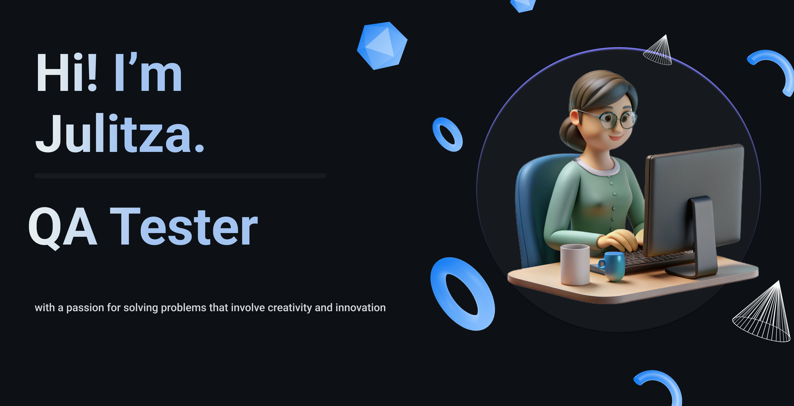

<!-- #   -->

#
Soy QA Tester Manual con un fuerte interés en la automatización de pruebas. Me apasiona garantizar la calidad del software, encontrando errores y optimizando procesos para un desarrollo más eficiente.

Aunque mi enfoque principal es el testing, también tengo conocimientos en desarrollo, lo que me permite entender mejor las aplicaciones y aportar en distintas etapas del ciclo de vida del software.

## 🛠️ Tecnologías y herramientas
Testing Manual & Automático | 

Desarrollo |

Colaboración |

